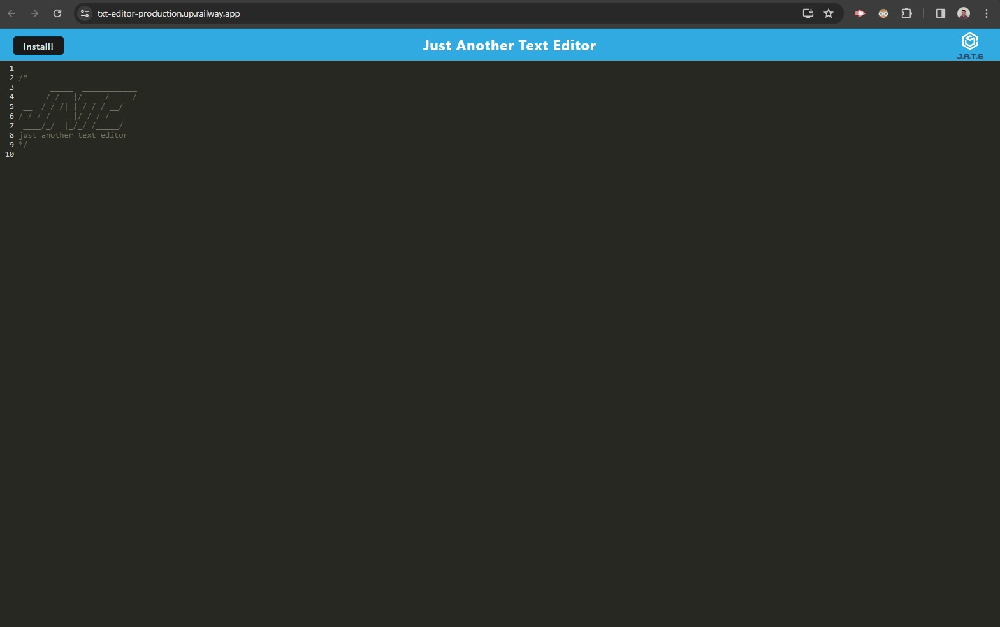

# txt-editor

## Description
This application allows you to connect with your database of ecommerce products so that users are able to use the application and receive correct data.  

## Installation

You can access this application using the following link. (txt-editor-production.up.railway.app)

## Usage
Access the link provided in the readme.

Type any information that you would like into the txt editor and it will save on the server for you to access at a later date. 

# Credits
N/A
element

# Screenshot

## License
Please refer to the LICENSE in the repo. 
